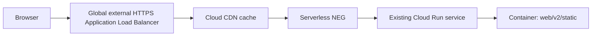

# Static asset serving and CDN plan

**Status:** research and recommendation (2026-09-24)

## Executive recommendation

Use the existing Cloud Run service as the **origin**, put it behind one Google global external Application Load Balancer with a **serverless NEG**, and enable **Cloud CDN on the backend service**. Keep the current application URLs and local development flow unchanged.

Do **not** introduce a second static-site deployment, a bucket-sync job, a frontend build pipeline, Terraform, or a new third-party CDN for this optimization. Those would add deployment and invalidation machinery that the app does not currently need.

The only application change should be to make the static responses explicitly cacheable. The existing templates already append `?v={{ static_asset_version }}` to CSS and JavaScript URLs, and `K_REVISION` changes on every Cloud Run revision. That gives us safe cache-busting with no asset-copy script:

- production: deploy the same Docker image as today; the load balancer/CDN serves `/static/*`, `/manifest.webmanifest`, and `/sw.js` from the Cloud Run origin;
- local development: continue serving `web/v2/static` directly from Axum at `localhost:8080`;
- HTML, API, login, SSE, webhook, and uploads: remain dynamic and are not cached.

This is the smallest change that uses Google’s native edge cache while preserving the current repository and deployment shape.

## Why this is the best fit here

The current image copies `web/v1` and `web/v2` into the container, and `src/webui/v2/maker.rs` serves `web/v2/static` through `ServeDir`. `cloudbuild.yaml` builds and publishes the image but does not currently deploy or synchronize a separate asset store. Separating assets into Cloud Storage would require a new upload/copy step, bucket IAM/public-access decisions, URL configuration, and a coordination rule between the asset version and the Cloud Run revision.

A global external Application Load Balancer plus Cloud CDN avoids that split:

1. The application remains the single source of truth for the shipped assets.
2. The first request is fetched from Cloud Run; subsequent cacheable requests are served at Google’s edge.
3. The browser continues to use the same relative URLs, so no local-vs-production asset URL problem is introduced.
4. A new revision changes `K_REVISION`, so the CSS/JS query string changes automatically. Old immutable URLs can expire naturally without purge scripts.
5. Cloud Run still handles HTML and authenticated/dynamic routes normally.

Cloud CDN is not attached directly to a Cloud Run URL. It operates with an external Application Load Balancer, whose backend can be a Cloud Run serverless NEG.

## Target topology



The same backend can route all paths to the current service. Cloud CDN only caches responses that are eligible under the response headers/cache policy; it does not make authenticated pages or API responses safe to cache automatically.

## Cache policy

### Static assets

For versioned CSS/JS URLs such as `/static/webui-v2.js?v=<revision>`:

```text
Cache-Control: public, max-age=31536000, immutable
```

This is appropriate because the URL changes when the deployed revision changes. The asset filename itself is currently stable, but the version query parameter is part of the browser/CDN cache key. `immutable` tells compatible clients not to revalidate during the year-long lifetime.

For `/static/favicon-32x32.png`, `/static/masonry.css`, and other static files that may not yet carry the version query parameter, either:

- add the same version query parameter in templates where practical; or
- use a shorter explicit TTL for unversioned assets, such as `public, max-age=3600`.

Prefer adding the version parameter to all application-controlled static asset references. Service worker and manifest URLs need special care because browsers give them update semantics:

- `/sw.js`: `Cache-Control: no-cache` (or a short TTL), so service-worker updates are discovered;
- `/manifest.webmanifest`: `public, max-age=3600` unless it is also deliberately versioned.

Do not apply the long immutable policy to HTML, `/api/*`, `/_wh/*`, `/events`, login/logout, or any response containing user-specific data or session cookies.

### CDN cache mode

Start with Cloud CDN’s standard **Use origin headers** behavior and explicit application headers. If the backend-service configuration needs to enforce a policy, use a cache mode that respects origin headers rather than a blanket “cache everything” rule. A blanket policy risks caching personalized HTML or responses that set cookies.

Do not cache responses that vary by user/session. The static asset routes are public and do not require the session-auth layer, but verify this with response headers before rollout.

## Required application change

Add a small response-header layer around the static routes in `src/webui/v2/maker.rs` (or an equivalent focused static-serving helper):

- `/static/*`: long-lived cache headers only for known static assets that are safe to publish;
- `/sw.js`: short/no-cache;
- `/manifest.webmanifest`: short cache;
- leave dynamic routes unchanged.

Use the existing relative URLs and `static_asset_version`; do not add an `ASSET_CDN_URL` environment variable unless a later requirement calls for a separate hostname.

One subtlety: a query parameter does not automatically make a response immutable. The server must still send an explicit `Cache-Control` header, and the CDN must be enabled on the load-balancer backend.

## Google Cloud setup (one-time infrastructure)

This is intentionally a one-time console/gcloud operation, not part of every application deploy:

1. Reserve a global external IP address.
2. Create a Google-managed certificate for the production hostname.
3. Create a serverless NEG in the same region as the existing Cloud Run service, targeting that service.
4. Create a global external HTTPS Application Load Balancer with the NEG as its backend.
5. Enable Cloud CDN on that backend service.
6. Point the production DNS record at the load balancer IP.
7. Set Cloud Run ingress to **Internal and Cloud Load Balancing** after validating the load balancer, so the default Cloud Run URL cannot bypass the CDN/load balancer.
8. Keep the Cloud Run service’s existing OIDC/task behavior in mind: Cloud Tasks and any other callers must still reach the service through an allowed route. Validate webhook/task URLs before changing ingress.

Google’s documented backend command shape is:

```text
gcloud compute backend-services update BACKEND_SERVICE_NAME --enable-cdn --global
```

The exact resource names and certificate/DNS commands should be recorded during the real production setup, but should not be embedded in the normal `cloudbuild.yaml` application build. This keeps the daily flow exactly as it is today:

```text
gcloud builds submit --config cloudbuild.yaml --substitutions=_IMAGE_TAG=<git revision>
```

If deployment is performed separately, deploy the newly built image to the same Cloud Run service as before. No asset synchronization or cache purge is needed for normal releases.

## Development and deployment behavior

### Local macOS / Docker development

No CDN is involved. `ServeDir` continues to serve files from the checked-out `web/v2/static` directory. Local templates continue to use relative `/static/...` URLs. Local cache headers may be identical to production or deliberately shorter; either choice is fine as long as browser testing can be refreshed easily.

### Production release

The Dockerfile remains the asset packaging mechanism. `COPY web/v1` and `COPY web/v2` ensure that the exact assets used by the templates are present in the deployed image. Cloud Build remains responsible only for building/publishing the image. The load balancer and CDN sit in front of the unchanged service.

Because `K_REVISION` is used in asset URLs, a new revision naturally creates new cache keys. This is preferable to an invalidation script for this project: it avoids ordering/race problems and makes rollback safe. A rollback points HTML at the previous revision’s asset URL; that URL should still be available from the old Cloud Run revision if the service retains it, or it will be refetched from the currently routed origin and the asset must exist there. Verify the chosen Cloud Run revision/traffic behavior before relying on rollback semantics.

## Alternatives considered

### Cloud Storage bucket + backend bucket + Cloud CDN

This is a good architecture for a genuinely independent static frontend or a large asset library. It is not the best first move here. It requires copying assets out of the image, coordinating asset versions with HTML deployments, managing bucket IAM/public access, and deciding whether the bucket is public. It would create the deployment hassle the request explicitly wants to avoid.

It remains a future option if static assets become independently deployed, large, shared by multiple services, or numerous enough that container packaging is a measurable problem.

### Direct Cloud Run static serving without CDN

This is the current design and has the fewest infrastructure components, but every cache miss and uncached request reaches a Cloud Run instance. It leaves easy latency and origin-load reduction unused.

### A separate third-party CDN

Unnecessary operational surface and another vendor. Google’s native Cloud CDN already integrates with the required Cloud Run serverless NEG and global load balancer.

### Asset URLs on a separate CDN hostname

Not recommended initially. It introduces environment configuration, CORS/origin details, and more template behavior for no benefit when path-based caching behind the existing production hostname is sufficient.

## Rollout checklist

- [ ] Confirm the current production hostname, Cloud Run region/service name, DNS provider, and task/webhook reachability.
- [ ] Create and test the global HTTPS load balancer and serverless NEG without changing application code.
- [ ] Add explicit cache headers only to static responses.
- [ ] Verify static response headers through the production hostname:
  - `Cache-Control` is present and correct;
  - `Set-Cookie` is absent;
  - authenticated HTML/API responses are not cacheable;
  - `Age`/CDN cache status appears on a repeated request where available.
- [ ] Enable Cloud CDN on the backend service.
- [ ] Update DNS and test HTML, login, CSS, JS, manifest, service worker, API, SSE, and webhook/task paths.
- [ ] Only after validation, restrict Cloud Run ingress to Internal and Cloud Load Balancing if all non-browser callers have been accounted for.
- [ ] Monitor Cloud CDN cache hit ratio and Cloud Run request/CPU reduction.
- [ ] Document the final resource names and DNS records in the deployment runbook.

## Risks and guardrails

- **Personalized response leakage:** never use a blanket cache-everything policy. Cache only explicit static routes, and inspect headers.
- **Stale service worker:** keep `/sw.js` short-lived/no-cache even when other assets are immutable.
- **Unversioned references:** add version parameters or use a short TTL for any asset reference that lacks one.
- **Ingress breakage:** changing Cloud Run ingress can break Cloud Tasks, webhooks, health/ops tooling, or direct administrative access. Test each caller first.
- **Infrastructure cost:** the load balancer and CDN add fixed/per-request network costs. For the current small app, confirm the cache hit ratio and Cloud Run reduction justify them; the architectural setup is still the cleanest native option if a CDN is desired.
- **Cache invalidation:** prefer new versioned URLs. Use explicit CDN invalidation only for an emergency or a mistakenly cacheable response, not as part of normal releases.

## Sources

- [Cloud CDN overview](https://docs.cloud.google.com/cdn/docs/overview) — Cloud CDN uses Google’s edge network, caches cacheable responses, and works with a global external Application Load Balancer.
- [Global external Application Load Balancer with Cloud Run](https://docs.cloud.google.com/load-balancing/docs/https/setup-global-ext-https-serverless) — serverless NEG setup, Cloud Run ingress restriction, and enabling Cloud CDN on the backend service.
- [Cloud CDN caching overview](https://docs.cloud.google.com/cdn/docs/caching) — cacheability, cache keys, origin headers, TTLs, and invalidation.
- [Cloud CDN cache modes](https://docs.cloud.google.com/cdn/docs/using-cache-modes) — choosing how origin headers and CDN policy interact.
- [Cloud Run ingress settings](https://docs.cloud.google.com/run/docs/securing/ingress) — restricting traffic to the load balancer after migration.
- [Cloud CDN pricing](https://cloud.google.com/cdn/pricing) — evaluate the added CDN/load-balancer cost against origin savings.

## Decision

Adopt **Cloud CDN in front of the existing Cloud Run origin via a global external HTTPS Application Load Balancer and serverless NEG**, with explicit static-route cache headers and no new asset deployment pipeline. Defer Cloud Storage-backed static hosting until assets need independent lifecycle/deployment or the container-based approach becomes a measurable bottleneck.
