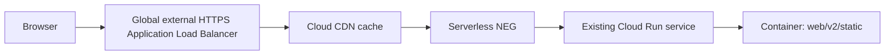

# Static asset serving and CDN plan

**Status:** cost-sensitive research and recommendation (2026-09-24)

## Executive recommendation

Do **not** add a Google Application Load Balancer solely to cache this app's small static bundle. The LB has a standing forwarding-rule charge plus per-byte processing charges, and Cloud CDN adds its own request and bandwidth charges. For a small or early-stage app, that fixed network cost can easily exceed the Cloud Run compute saved by caching CSS and JavaScript.

The cost-conscious recommendation is:

1. **Now:** keep serving assets from Cloud Run, but add explicit browser-friendly cache headers and retain the existing revision-based asset versioning. This gets most of the benefit for zero new infrastructure and makes repeat visits avoid the origin in the user's browser.
2. **If a real edge cache is worth paying for:** put the existing service behind **Firebase Hosting**, use Hosting's CDN and Cloud Run rewrite, and preserve the same hostname if practical. Firebase Hosting is the lower-cost Google-managed alternative to a Google Application Load Balancer, but it adds a Firebase Hosting deployment/configuration layer and must be tested against this app's cookies, SSE, uploads, and webhooks.
3. **Only at meaningful traffic:** use the global external Application Load Balancer plus Cloud CDN. It is the cleanest native Google Cloud architecture and supports path routing/security controls, but it is not the cheap option.

Keep the current application URLs and local development flow unchanged where possible. Do not adopt the original LB-first recommendation without first comparing the measured static egress and request volume with the LB/CDN estimate.

Do **not** introduce a second static-site deployment, a bucket-sync job, a frontend build pipeline, Terraform, or a new third-party CDN for this optimization. Those would add deployment and invalidation machinery that the app does not currently need.

The only application change should be to make the static responses explicitly cacheable. The existing templates already append `?v={{ static_asset_version }}` to CSS and JavaScript URLs, and `K_REVISION` changes on every Cloud Run revision. That gives us safe cache-busting with no asset-copy script:

- production: deploy the same Docker image as today; the load balancer/CDN serves `/static/*`, `/manifest.webmanifest`, and `/sw.js` from the Cloud Run origin;
- local development: continue serving `web/v2/static` directly from Axum at `localhost:8080`;
- HTML, API, login, SSE, webhook, and uploads: remain dynamic and are not cached.

The first option is the smallest change and preserves the current repository and deployment shape. It does not provide a global shared CDN cache, but immutable browser caching is likely sufficient for this app's current scale.

## Cost comparison

Prices change, so use the linked pricing pages and the Google Cloud pricing calculator for the final estimate. The figures below are the important cost shape as of 2026-09-24, not a billing quote.

| Option | New standing cost | Usage costs | Deployment hassle | Recommendation |
| --- | --- | --- | --- | --- |
| Cloud Run + browser caching | None beyond current Cloud Run/network usage | Cloud Run handles first requests; browser handles repeat requests | None | **Default now** |
| Firebase Hosting + Cloud Run rewrite | Hosting usage/storage/network pricing; verify current plan and quotas | Hosting CDN delivery and any Cloud Run requests that miss/are dynamic | Moderate: add `firebase.json` and a Hosting deploy step | Best low-cost managed edge option to investigate |
| Cloud Storage public objects | Low storage/operation cost; internet egress still applies | Storage reads and egress; no CDN unless another CDN is added | Moderate: copy assets and manage URLs/versioning | Cheap asset origin, not automatically an edge CDN |
| Cloud Storage + LB + Cloud CDN | LB forwarding rule and data processing, plus Storage/CDN | CDN lookups, cache fill, cache egress, Storage | High | Only when traffic justifies it |
| External CDN proxy (for example Cloudflare Free) | Potentially no CDN subscription charge | Origin egress and provider-specific limits/policies | Moderate: DNS/proxy, cookie/SSE testing, vendor dependency | Viable cheapest shared CDN if non-Google service is acceptable |
| Cloud Run + global LB + Cloud CDN | One global forwarding rule is currently listed at $0.025/hour, about $18.25/month, before data processing | LB processing plus CDN request/cache-fill/egress charges | High | **Do not use for this small bundle solely for caching** |

The LB pricing page states that the first five forwarding rules cost $0.025/hour and regional external Application Load Balancers can be cheaper in some single-region cases. However, even the roughly $18/month global forwarding-rule baseline is material for a low-traffic prototype, before the $0.008/GiB regional processing example, internet egress, and Cloud CDN charges. Cloud CDN itself lists cache lookup, cache fill, and cache data-transfer-out charges; it is not a free cache layer.

Cloud Run's current pricing documentation says traffic passed from an external Application Load Balancer does not incur Cloud Run data-transfer charges, but that does not make the LB free. The correct comparison is total bill, not one line item.

## Why this is the best fit here

The current image copies `web/v1` and `web/v2` into the container, and
`src/webui/v2/maker.rs` serves `web/v2/static` through `ServeDir`. The
`Dockerfile` packages `dreamscroll_web`, `dreamscroll_api`, and
`dreamscroll_admin`. `gcloud/cloudbuild.yaml` builds and publishes the image but
does not currently deploy or synchronize a separate asset store. The manual
`gcloud/docker-build-push.sh` helper can be run from the repository root while
using the root Dockerfile/build context. Separating assets into Cloud Storage
would require a new upload/copy step, bucket IAM/public-access decisions, URL
configuration, and a coordination rule between the asset version and the Cloud
Run revision.

A global external Application Load Balancer plus Cloud CDN avoids that split:

1. The application remains the single source of truth for the shipped assets.
2. The first request is fetched from Cloud Run; subsequent cacheable requests are served at Google’s edge.
3. The browser continues to use the same relative URLs, so no local-vs-production asset URL problem is introduced.
4. A new revision changes `K_REVISION`, so the CSS/JS query string changes automatically. Old immutable URLs can expire naturally without purge scripts.
5. Cloud Run still handles HTML and authenticated/dynamic routes normally.

Cloud CDN is not attached directly to a Cloud Run URL. It operates with an external Application Load Balancer, whose backend can be a Cloud Run serverless NEG.

## Target topology



The same backend can route all paths to the current service. Cloud CDN only caches responses that are eligible under the response headers/cache policy; it does not make authenticated pages or API responses safe to cache automatically.

## Cache policy

### Static assets

For versioned CSS/JS URLs such as `/static/webui-v2.js?v=<revision>`:

```text
Cache-Control: public, max-age=31536000, immutable
```

This is appropriate because the URL changes when the deployed revision changes. The asset filename itself is currently stable, but the version query parameter is part of the browser/CDN cache key. `immutable` tells compatible clients not to revalidate during the year-long lifetime.

For `/static/favicon-32x32.png`, `/static/masonry.css`, and other static files that may not yet carry the version query parameter, either:

- add the same version query parameter in templates where practical; or
- use a shorter explicit TTL for unversioned assets, such as `public, max-age=3600`.

Prefer adding the version parameter to all application-controlled static asset references. Service worker and manifest URLs need special care because browsers give them update semantics:

- `/sw.js`: `Cache-Control: no-cache` (or a short TTL), so service-worker updates are discovered;
- `/manifest.webmanifest`: `public, max-age=3600` unless it is also deliberately versioned.

Do not apply the long immutable policy to HTML, `/api/*`, `/_wh/*`, `/events`, login/logout, or any response containing user-specific data or session cookies.

### CDN cache mode

Start with Cloud CDN’s standard **Use origin headers** behavior and explicit application headers. If the backend-service configuration needs to enforce a policy, use a cache mode that respects origin headers rather than a blanket “cache everything” rule. A blanket policy risks caching personalized HTML or responses that set cookies.

Do not cache responses that vary by user/session. The static asset routes are public and do not require the session-auth layer, but verify this with response headers before rollout.

## Required application change

Add a small response-header layer around the static routes in `src/webui/v2/maker.rs` (or an equivalent focused static-serving helper):

- `/static/*`: long-lived cache headers only for known static assets that are safe to publish;
- `/sw.js`: short/no-cache;
- `/manifest.webmanifest`: short cache;
- leave dynamic routes unchanged.

Use the existing relative URLs and `static_asset_version`; do not add an `ASSET_CDN_URL` environment variable unless a later requirement calls for a separate hostname.

One subtlety: a query parameter does not automatically make a response immutable. The server must still send an explicit `Cache-Control` header, and the CDN must be enabled on the load-balancer backend.

## Google Cloud setup (one-time infrastructure)

This is intentionally a one-time console/gcloud operation, not part of every application deploy:

1. Reserve a global external IP address.
2. Create a Google-managed certificate for the production hostname.
3. Create a serverless NEG in the same region as the existing Cloud Run service, targeting that service.
4. Create a global external HTTPS Application Load Balancer with the NEG as its backend.
5. Enable Cloud CDN on that backend service.
6. Point the production DNS record at the load balancer IP.
7. Set Cloud Run ingress to **Internal and Cloud Load Balancing** after validating the load balancer, so the default Cloud Run URL cannot bypass the CDN/load balancer.
8. Keep the Cloud Run service’s existing OIDC/task behavior in mind: Cloud Tasks and any other callers must still reach the service through an allowed route. Validate webhook/task URLs before changing ingress.

Google’s documented backend command shape is:

```text
gcloud compute backend-services update BACKEND_SERVICE_NAME --enable-cdn --global
```

The exact resource names and certificate/DNS commands should be recorded during the real production setup, but should not be embedded in the normal `gcloud/cloudbuild.yaml` application build. This keeps the daily flow exactly as it is today:

```text
gcloud builds submit --config gcloud/cloudbuild.yaml --substitutions=_IMAGE_TAG=<git revision>
```

If deployment is performed separately, deploy the newly built image to the same Cloud Run service as before. No asset synchronization or cache purge is needed for normal releases.

## Development and deployment behavior

### Local macOS / Docker development

No CDN is involved. `ServeDir` continues to serve files from the checked-out `web/v2/static` directory. Local templates continue to use relative `/static/...` URLs. Local cache headers may be identical to production or deliberately shorter; either choice is fine as long as browser testing can be refreshed easily.

### Production release

The Dockerfile remains the asset packaging mechanism. `COPY web/v1` and `COPY web/v2` ensure that the exact assets used by the templates are present in the deployed image. Cloud Build remains responsible only for building/publishing the image. The load balancer and CDN sit in front of the unchanged service.

Because `K_REVISION` is used in asset URLs, a new revision naturally creates new cache keys. This is preferable to an invalidation script for this project: it avoids ordering/race problems and makes rollback safe. A rollback points HTML at the previous revision’s asset URL; that URL should still be available from the old Cloud Run revision if the service retains it, or it will be refetched from the currently routed origin and the asset must exist there. Verify the chosen Cloud Run revision/traffic behavior before relying on rollback semantics.

## Alternatives considered

### Firebase Hosting + Cloud Run rewrite (new cost-sensitive candidate)

Firebase Hosting provides a managed global CDN and can rewrite requests to Cloud Run. Firebase documents that static content is automatically cached and that dynamic Cloud Run content is not cached by default; explicit `Cache-Control` headers can control cache behavior. This avoids adding a Google Cloud Load Balancer, but it adds Firebase Hosting configuration and a separate Hosting deployment/release step.

This is the most promising managed option if browser caching is insufficient and the app can tolerate the integration boundary. Do not blindly route the whole application through it: test the session cookie, login/logout, SSE, uploads, Cloud Tasks, webhook OIDC, request timeout, and large request-body behavior. Firebase Hosting documents a 60-second request timeout for rewrites, which may conflict with long-lived `/events` SSE requests or slow uploads. A path split could be safer, but it may require a new asset hostname or a separate frontend origin.

Potential shape:

```text
app.example.com/static/*  -> Firebase Hosting static/CDN content
app.example.com/*         -> Cloud Run rewrite (only if timeout/cookie behavior is acceptable)
```

The low-hassle version would deploy the same checked-in static directory through Firebase Hosting, but that means adding a Hosting deployment command to the release flow. If that is considered unacceptable, stay with browser caching.

### Cloud Storage bucket + backend bucket + Cloud CDN

This is a good architecture for a genuinely independent static frontend or a large asset library. It is not the best first move here. It requires copying assets out of the image, coordinating asset versions with HTML deployments, managing bucket IAM/public access, and deciding whether the bucket is public. It would create the deployment hassle the request explicitly wants to avoid.

It remains a future option if static assets become independently deployed, large, shared by multiple services, or numerous enough that container packaging is a measurable problem.

### Cloud Storage without a CDN

Moving the assets to a public Cloud Storage bucket is cheaper than an LB/CDN and removes static requests from Cloud Run, but it is not an edge cache. It also introduces a copy step and public-bucket/security decisions. It can be worthwhile if Cloud Run origin load is the main concern and global edge latency is not.

### Direct Cloud Run static serving without CDN

This is the current design and has the fewest infrastructure components, but every cache miss and uncached request reaches a Cloud Run instance. It leaves easy latency and origin-load reduction unused.

### A separate third-party CDN

An external reverse-proxy CDN such as Cloudflare can avoid the Google LB fixed charge and is worth considering if the lowest possible CDN bill matters more than keeping all traffic inside Google Cloud. Cloudflare documents a free plan and edge caching available on all plans. The tradeoff is DNS/proxy ownership, vendor dependency, origin-egress behavior, cookie/SSE testing, and possible free-plan limitations. Do not put user-specific media or authenticated responses into a shared cache.

### Asset URLs on a separate CDN hostname

Not recommended initially. It introduces environment configuration, CORS/origin details, and more template behavior for no benefit when path-based caching behind the existing production hostname is sufficient.

## Rollout checklist

- [ ] Confirm the current production hostname, Cloud Run region/service name, DNS provider, and task/webhook reachability.
- [ ] Measure current static request count, bytes, Cloud Run request/compute cost, and geographic latency.
- [ ] Add explicit browser cache headers only to static responses.
- [ ] Decide whether browser caching is sufficient before adding any proxy/CDN.
- [ ] If shared edge caching is required, price Firebase Hosting and an external CDN before Google Cloud LB/CDN.
- [ ] Only if the measured traffic justifies it, create and test the global HTTPS load balancer and serverless NEG.
- [ ] Verify static response headers through the production hostname:
  - `Cache-Control` is present and correct;
  - `Set-Cookie` is absent;
  - authenticated HTML/API responses are not cacheable;
  - `Age`/CDN cache status appears on a repeated request where available.
- [ ] If using the LB path, enable Cloud CDN on the backend service.
- [ ] If using Firebase Hosting or an external CDN, test HTML, login, CSS, JS, manifest, service worker, API, SSE, and webhook/task paths before changing DNS.
- [ ] Only after validation, restrict Cloud Run ingress to Internal and Cloud Load Balancing if the chosen architecture supports all non-browser callers.
- [ ] Monitor Cloud CDN cache hit ratio and Cloud Run request/CPU reduction.
- [ ] Document the final resource names and DNS records in the deployment runbook.

## Risks and guardrails

- **Personalized response leakage:** never use a blanket cache-everything policy. Cache only explicit static routes, and inspect headers.
- **Stale service worker:** keep `/sw.js` short-lived/no-cache even when other assets are immutable.
- **Unversioned references:** add version parameters or use a short TTL for any asset reference that lacks one.
- **Ingress breakage:** changing Cloud Run ingress can break Cloud Tasks, webhooks, health/ops tooling, or direct administrative access. Test each caller first.
- **Infrastructure cost:** the load balancer and CDN add fixed/per-request network costs. For the current small app, assume the LB is not justified until measured savings exceed roughly its monthly forwarding-rule baseline plus processing/CDN charges.
- **Firebase integration cost:** Firebase may be cheaper than an LB, but its rewrite timeout and cookie/request behavior can conflict with this app. Use it for static hosting only or do not use it if the required path split creates more hassle than it saves.
- **Cache invalidation:** prefer new versioned URLs. Use explicit CDN invalidation only for an emergency or a mistakenly cacheable response, not as part of normal releases.

## Sources

- [Cloud CDN overview](https://docs.cloud.google.com/cdn/docs/overview) — Cloud CDN uses Google’s edge network, caches cacheable responses, and works with a global external Application Load Balancer.
- [Global external Application Load Balancer with Cloud Run](https://docs.cloud.google.com/load-balancing/docs/https/setup-global-ext-https-serverless) — serverless NEG setup, Cloud Run ingress restriction, and enabling Cloud CDN on the backend service.
- [Cloud CDN caching overview](https://docs.cloud.google.com/cdn/docs/caching) — cacheability, cache keys, origin headers, TTLs, and invalidation.
- [Cloud CDN cache modes](https://docs.cloud.google.com/cdn/docs/using-cache-modes) — choosing how origin headers and CDN policy interact.
- [Cloud Run ingress settings](https://docs.cloud.google.com/run/docs/securing/ingress) — restricting traffic to the load balancer after migration.
- [Cloud CDN pricing](https://cloud.google.com/cdn/pricing) — evaluate the added CDN/load-balancer cost against origin savings.
- [Cloud Load Balancing pricing](https://cloud.google.com/load-balancing/pricing) — forwarding-rule and data-processing charges; first five forwarding rules are listed at $0.025/hour.
- [Cloud Run pricing](https://cloud.google.com/run/pricing) — current Cloud Run compute, request, and data-transfer pricing.
- [Firebase Hosting with Cloud Run](https://firebase.google.com/docs/hosting/cloud-run) — Hosting rewrites to Cloud Run and the 60-second rewrite timeout.
- [Firebase Hosting cache behavior](https://firebase.google.com/docs/hosting/manage-cache) — static caching and `Cache-Control` behavior.
- [Cloudflare Free plan](https://www.cloudflare.com/plans/free/) and [Cloudflare Cache](https://developers.cloudflare.com/cache/) — external low-cost/free CDN alternative.

## Decision

Adopt **browser caching first**, with explicit static-route cache headers and the existing revision-based URLs. Record the Google LB + Cloud CDN design as the high-scale/native option, but reject it as the default because of its fixed and usage-based cost. If browser caching is insufficient, investigate Firebase Hosting and an external CDN as lower-cost alternatives before paying for a Google Application Load Balancer. Defer Cloud Storage-backed static hosting until assets need an independent lifecycle or Cloud Run origin load becomes measurable.
