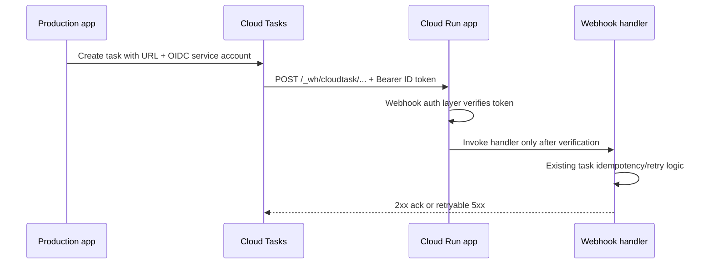

# Webhook authentication when hosted by the production Cloud Run service

## Recommendation

Keep the webhook routes in the existing production Cloud Run service, but protect
only the `/_wh/*` route group with application-level verification of a Google-signed
OIDC ID token. Configure each Cloud Tasks queue to send an OIDC token minted for a
dedicated service account, and accept only that service account as the caller.

This preserves the current single-service deployment and does not require the UI or
user API to use Google IAM. The service remains reachable from the public internet,
but a request cannot execute webhook work unless it has a valid token with the
expected audience and caller identity.

The important distinction is:

- **Cloud Run IAM authentication** is service-wide. It cannot protect only
  `/_wh/*` while leaving the browser UI and user API public.
- **Application-level OIDC verification** can be applied only to the webhook router.
  That is the appropriate mechanism for this mixed public/private service.

## Current integration points

The existing code already has a natural boundary for this change:

- `src/webhook/maker.rs` constructs the webhook router.
- `src/bin/dreamscroll_web.rs` nests it under `/_wh` when `SERVICES` includes
  `webhook`.
- `src/task/taskqueue_cloudtask.rs` creates Cloud Tasks HTTP requests, but currently
  uses a placeholder URL and does not set an OIDC token configuration.
- `src/config/config_def.rs` owns environment-backed configuration.
- `src/webhook/localclient.rs` intentionally performs unauthenticated local calls.

The existing task envelope idempotency and retry handling should remain unchanged.
OIDC authenticates the caller; it does not replace `TaskMaster::begin_attempt` or the
persisted task status checks.

## JWT/OIDC strategy for the whole application

### Existing JWT usage

The application currently has one deliberately narrow, first-party JWT system in
`src/auth/jwt.rs`:

- `POST /api/token` authenticates a Dreamscroll username and password, then issues a
  one-day HS256 access token.
- `JwtConfig` owns both the HMAC signing and verification key.
- Protected REST routes use an Axum extractor backed by `JwtAxumLayer`.
- Claims include `sub`, `username`, `is_admin`, `storage_shard`, `iat`, and `exp`.
- `Validation` explicitly selects HS256 and requires `sub` and `exp`.
- `src/auth/autherror.rs` maps `jsonwebtoken` errors into the application's public
  authentication errors.

This is not currently a JWKS-based system. The application issues and verifies its
own symmetric tokens; no external issuer, key discovery, or key rotation is involved.
The session-cookie path is separate and is handled by `axum-login`/Tower Sessions.

The implementation is reasonably small and the core cryptographic operation is
already delegated to the maintained `jsonwebtoken` crate. The main architectural
risks are not that JWT was handwritten, but that the token is a long-lived snapshot
of authorization data and that the current validation policy is implicit in code:

- `is_admin`, `storage_shard`, and `username` remain valid until token expiry, so
  permission or account changes do not take effect immediately.
- There is no configured issuer or audience for the application's own tokens.
- There is no token revocation or key rotation mechanism beyond replacing the global
  `JWT_SECRET`.
- `JwtConfig::from_secret` asserts on a short secret rather than returning a startup
  configuration error.
- `deny_unknown_fields` is strict, but adding a claim later is a compatibility change
  for outstanding tokens.
- The user JWT and Google Cloud OIDC token are different trust domains and must not
  share claims, keys, or validation configuration.

These are manageable limitations for a small first-party API token, but they should
be made explicit before adding external OIDC verification.

### Candidate crates

There are good third-party building blocks, but no reason to replace the current
implementation wholesale with a general authentication framework.

| Crate                    | Fit for this application                                                                                                                                                                                                                                                                                                                                                                               |
| ------------------------ | ------------------------------------------------------------------------------------------------------------------------------------------------------------------------------------------------------------------------------------------------------------------------------------------------------------------------------------------------------------------------------------------------------ |
| `jsonwebtoken`           | Best low-level JWT/JWK primitive for the current use. It provides typed claims, explicit algorithms, validation, JWK types, and supports the project's `aws-lc-rs` crypto backend. It does not provide a complete issuer/JWKS cache or Axum policy layer, so those must be supplied by the application or a higher-level crate.                                                                        |
| `google-cloud-auth`      | Best fit for the planned Cloud Tasks Google ID-token verifier. The version family already used by this project exposes `credentials::idtoken::verifier::Builder`; it validates Google issuers, audience, signature keys, clock skew, and optionally verified service-account email. It also caches/fetches Google signing certificates. Prefer this over implementing Google JWKS retrieval ourselves. |
| `openidconnect`          | Mature, strongly typed OIDC protocol library with discovery, provider metadata, JWKS, and ID-token verification. It is appropriate if Dreamscroll becomes a general OIDC relying party for user login or multiple providers. It is broader than needed for Google Cloud Tasks service-account tokens and would add substantial generic protocol surface.                                               |
| `jwt-simple-jwks`        | A small JWKS-oriented option, but less established in this codebase and less Google-specific. It would still leave issuer/audience/service-account policy and integration decisions to us. Do not add it merely to avoid using `jsonwebtoken`.                                                                                                                                                         |
| `josekit` / `jwt-simple` | General JOSE/JWT alternatives, not a compelling improvement for this project. Switching would create migration and audit work without solving the application-specific trust-policy problem.                                                                                                                                                                                                           |

The practical conclusion is to keep `jsonwebtoken` for Dreamscroll-issued HS256
tokens and use the existing `google-cloud-auth` verifier for Google-issued Cloud
Tasks ID tokens. Both ultimately use JWT verification primitives, but they should be
wrapped in separate domain-specific types so a user token cannot accidentally be
accepted as a Google token or vice versa.

### Recommended systemic boundary

Use three explicit layers rather than one universal `JwtConfig`:

1. **Session authentication** — browser UI login and cookies, unchanged.
2. **Dreamscroll API tokens** — `DreamscrollJwt`/`JwtConfig`, issued by this service
  and verified with the configured HS256 secret. Keep this only for the REST API.
3. **Google workload identity** — `GoogleIdTokenVerifier`, backed by
  `google-cloud-auth`, used only by the webhook middleware. It must enforce the
  Google issuer, exact audience, expiry/clock skew, and the dedicated service-account
  email with `email_verified=true`.

Do not consolidate these into a single generic `AuthToken` or accept an algorithm,
issuer, or key source from the request. The security boundary is the trust domain,
not merely the fact that both credentials happen to use JWT serialization.

The recommended hardening work for Dreamscroll-issued API tokens is tracked separately
in `plan/api_token_hardening.md`. It is not a prerequisite for choosing the Google
verifier, and the webhook change should not reuse the user-token `JwtConfig` while that
cleanup is in progress.

### Decision

Do **not** migrate the existing user JWTs to `openidconnect`, `jwt-simple`, or another
replacement crate solely because webhooks introduce JWKS. Retain `jsonwebtoken` as the
low-level JWT implementation already in use, add the Google-specific verifier from
`google-cloud-auth`, and isolate both behind separate authentication modules. Revisit
`openidconnect` only if the product later needs interactive login with an external OIDC
provider, discovery, authorization-code/PKCE flows, or multiple issuers.

## Proposed request flow

## Google Cloud configuration

Create a dedicated service account for task delivery, for example:

`dreamscroll-prod-cloud-tasks@mdrcode.iam.gserviceaccount.com`

Grant it only the permissions needed to invoke the target service if Cloud Run IAM
is also used elsewhere. For this design, the application validates its identity, so
`roles/run.invoker` is not required merely for the route-level check; granting it is
still useful if the service is later switched to Cloud Run platform authentication.
Do not reuse the app's broad runtime service account.

For each Cloud Tasks queue, configure the HTTP target with:

- `POST` method
- The actual production URL, including the route, such as
  `https://prod.example.com/_wh/cloudtask/illuminate`
- `Content-Type: application/json`
- An OIDC token minted by the dedicated task-delivery service account
- An explicit audience matching the configured audience exactly

The audience should be a stable value owned by this application, preferably the
production service origin (for example `https://prod.example.com`) rather than a
request URL containing a task-specific path. The verifier must use the same exact
value. If the service has more than one public hostname, choose one canonical
hostname and configure Cloud Tasks to use it consistently.

Cloud Tasks normally supplies the token through the standard `Authorization: Bearer
...` header. The token is an ID token, not an OAuth access token; do not validate it
as a user JWT or use the application's `JWT_SECRET` for it.

The queue's target URL should be configuration, not hard-coded. The current dummy URL
in `src/task/taskqueue_cloudtask.rs` must be replaced by a required production
configuration value. A single base URL plus route suffixes is less error-prone than
three independently configured full URLs.

Suggested new settings:

- `TASK_WEBHOOK_BASE_URL` — the webhook base URL; e.g.
  `https://prod.example.com`
- `TASK_OIDC_SERVICE_ACCOUNT_EMAIL` — required for `gcloudtasks`
- `TASK_OIDC_AUDIENCE` — required for `gcloudtasks`
The Cloud Tasks OIDC service-account email and audience are also the webhook verifier's
expected identity and audience. Keeping one canonical pair avoids configuration drift
between the sender and receiver.

## Rust implementation design

### 1. Add a small webhook authentication layer

Add a module under `src/webhook`, for example `oidc.rs`, containing:

- Configuration for the expected audience and service-account email.
- An Axum/Tower layer or middleware that extracts `Authorization`.
- Verification of the Google-signed ID token.
- A clear distinction between authentication failures (`401 Unauthorized`) and
  authenticated-but-disallowed callers (`403 Forbidden`), if the implementation can
  reliably make that distinction.

Apply this layer in `make_webhook_router` only when webhook authentication is enabled.
The route handlers should not each parse headers or duplicate token checks.

The layer should reject:

- Missing or malformed `Authorization` headers.
- Non-Bearer schemes.
- Expired or not-yet-valid tokens.
- Tokens with the wrong issuer.
- Tokens with the wrong exact audience.
- Tokens whose verified `email`/`sub` is not the configured task service account.
- Tokens without the expected verified service-account identity.

Use Google's published signing keys and cache them with a bounded refresh policy. The
current `google-cloud-auth` verifier already does this: its internal JWKS client caches
each key for one hour and shares that cache across requests using the single verifier
created at application startup. It also fetches the JWKS when it encounters an unknown
key ID, so normal Google key rotation does not require a deployment. Do not fetch keys
for every request.

The crate does not retry a failed JWKS fetch. A transient Google certificate-endpoint
failure can therefore cause webhook authentication failures until a later request
retries the fetch. This is an intentional MVP trade-off documented in
`plan/pragmatism.md`; add retry/backoff only if this becomes operationally visible.

The application uses the maintained Google verifier rather than hand-rolling JWKS
retrieval. `jsonwebtoken` remains the underlying JWT primitive, but the application
does not own the Google key cache or certificate-fetch logic.

### 2. Keep local development simple

Local task delivery must continue to work without Google credentials. The existing
`TaskQueueBackend::Local` path and `LocalWebhookClient` should remain unauthenticated.
The production-only behavior should be selected explicitly by configuration, not by
whether a request happens to contain a token.

Recommended behavior:

- `TASK_BACKEND=local`: authentication disabled and local direct calls work as today.
- `TASK_BACKEND=gcloudtasks`: webhook OIDC authentication required by default.
- Optional explicit `WEBHOOK_OIDC_ENABLED=false` may be retained for tests, but should
  be rejected or loudly warned when `K_SERVICE` is set or when the Cloud Tasks backend
  is selected. Avoid a silent production bypass.

Do not add a shared static secret, IP allowlist, or user JWT as a substitute for OIDC.
Those approaches are weaker, harder to rotate, or do not prove the caller's Google
service-account identity.

### 3. Configure Cloud Tasks in code

Extend `CloudTaskQueue` or its constructor with the target URL, service-account email,
and audience. Build each task's `HttpRequest` with the OIDC token configuration
supported by the Google Cloud Tasks client model (`OidcToken` / equivalent for the
crate version), rather than relying on queue defaults.

Construct the three paths from one base URL:

- `/_wh/cloudtask/illuminate`
- `/_wh/cloudtask/search_index`
- `/_wh/cloudtask/spark`

Validate the base URL at startup. It should be HTTPS in production, have no embedded
credentials, and have no path unless the application intentionally supports a path
prefix. Fail startup when required Cloud Tasks/OIDC values are absent; a task queue
that can enqueue requests which can never authenticate is a configuration error.

## Failure and security behavior

- Return `401` for absent/invalid credentials. Cloud Tasks will retry according to
  its queue policy, so configuration errors should be visible in logs and metrics.
- Return `403` for a valid Google token from an unexpected principal, if distinguishable.
- Preserve the existing handler status behavior: successful or already-complete tasks
  return 2xx; retryable task failures return 5xx; permanent task failures return the
  existing non-retry response.
- Never log the raw token. Log only route, token issuer, key ID, and verified principal
  after safe redaction, and avoid logging untrusted claims at high volume.
- Keep webhook routes free of browser/session authentication and CSRF assumptions.
  They are machine-to-machine endpoints and must not accept browser cookies as proof.
- Consider adding a small request body limit before authentication or retain the
  existing 5 MiB limit; authentication must happen before expensive task execution.

OIDC does not provide replay prevention. That is acceptable here because Cloud Tasks
is at-least-once delivery and the existing envelope/run persistence is the replay
protection for work execution. A valid token can be replayed during its lifetime, but
it cannot cause a task to execute twice successfully when the existing idempotency
checks reject completed runs.

## Testing plan

Unit tests should cover:

- Missing, malformed, wrong-scheme, expired, wrong-issuer, wrong-audience, wrong
  service-account, and valid tokens.
- Key rotation / unknown key ID refresh behavior, using a test JWKS endpoint or an
  injected key provider rather than Google's live endpoint.
- Router behavior proving the OIDC layer protects `/_wh/*` only and does not affect
  public UI/API routes.
- Configuration validation for local and Cloud Tasks backends.
- Exact URL and OIDC settings attached to a generated Cloud Tasks request, without
  making a network call.

An integration check should enqueue one task in a non-production queue targeting the
same service and verify that the task is accepted. Also verify that a request signed
by another service account receives `401`/`403` and does not enter the handler.

## Rollout sequence

1. Add configuration parsing and fail-fast validation, while leaving the separate
   webhook service unchanged.
2. Add the verifier and route-scoped middleware with local mode explicitly disabled.
3. Configure a staging queue and dedicated service account; test valid and invalid
   callers.
4. Set production Cloud Tasks URLs and OIDC settings, deploy the unified service, and
   observe task success/retry metrics.
5. Drain/disable the old webhook Cloud Run service only after the new queue delivery
   path has been verified.
6. Remove the old service and any obsolete IAM-only deployment configuration.

## Deliberate scope boundary

This design does not add custom webhook signatures, external webhook-provider
verification, replay windows, a general-purpose Google token library, or a new proxy.
Those may be appropriate for third-party webhooks, but the current routes are Cloud
Tasks callbacks and the simplest robust control is a dedicated Cloud Tasks service
account plus strict route-scoped Google OIDC verification.

Before implementation, confirm the intended canonical production URL and whether the
current Cloud Tasks queues are managed manually or from infrastructure-as-code. Those
two details determine the exact configuration and rollout changes, but do not change
the architecture above.
